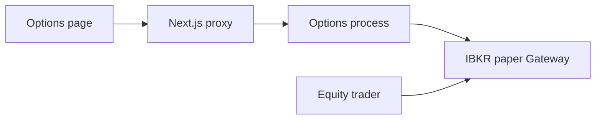

# Paper options desk

Saved spec only. The equity trader is unchanged. Dropping this idea is reverting the commit that added this file.

Yes. Two limits shape the first version.

- The dashboard you already have is the equity trader (Overview, Trades, Predictions, and the rest). It stays. Options becomes a separate page in the same app, so one login covers both.
- IBKR’s API cannot download every symbol it offers. Search is type-ahead: you type a ticker or company name, IBKR returns matches, and you open that stock or ETF’s option chain. US stocks and ETFs only (AAPL, SPY, and similar).

Orders go to the **paper** Gateway only (ports 4002 and 7497, already defined in [`trader/config.py`](../trader/config.py)). Live orders stay a later step, behind the same kind of explicit confirmation the equity bot already uses.

## Why a second IBKR connection

The equity bot owns one IBKR session inside [`trader/broker/ibkr.py`](../trader/broker/ibkr.py) and only trades US stocks. The dashboard never talks to IBKR; it only reads Supabase and can queue a stock close. An options chain needs quick back-and-forth (search, expirations, quotes, a cost check, then an order), so it should not share that session or wait on the bot’s loop.

A small local options process uses its own client id (`IBKR_CLIENT_ID + 20`) against the same Gateway. The equity bot keeps running. You start the options process yourself when you want the page; nothing restarts the trader.

## What the page does

New nav item **Options** in [`dashboard/components/dashboard-nav.tsx`](../dashboard/components/dashboard-nav.tsx), route [`dashboard/app/(dashboard)/options/page.tsx`](../dashboard/app/(dashboard)/options/page.tsx).

- **Search.** Type at least two characters. Matches are US stocks and ETFs that actually have options.
- **Chain.** Pick an expiration. Show strikes near the current stock price (about 15 strikes), with call and put bid, ask, and last. Far strikes stay unloaded so we do not blow IBKR’s market-data line limit. A refresh button reloads quotes; the page does not stream the whole chain.
- **Ticket.** Click a call or put. Choose how many contracts and a limit price (starts at the ask). The page shows the cash debit in plain language: contracts × limit × 100 shares per contract. A what-if check against IBKR adds estimated commission and buying-power impact before you send.
- **Send.** Limit buy, day order, on the paper account. A confirm step repeats symbol, call or put, strike, expiration, contracts, limit, and estimated debit. A cap (default 10 contracts) blocks a typo.
- **What you hold.** Open option positions from the paper account, with a sell-to-close limit (default at the bid) and the same cost preview, shown as a credit.

No spreads, no short options, no market orders. Market orders on options can fill far from the quote you just looked at.

## Options process

New code under `trader/options/`, started with `python -m options.api` from `trader/`. It listens on `127.0.0.1` only. The Next server proxies it (`/api/options/...`) so the browser never sees the token. Refuses every order if `IBKR_PORT` is not a paper port.

Endpoints: search, chain, estimate, place buy, positions, sell to close. Cost math and the paper-port refusal get unit tests with a fake IB client. Chain quotes use snapshots, then cancel, so they do not hold data lines next to the equity bot.

Quotes depend on your IBKR market-data permission for US options. The equity bot’s example config uses delayed data, which often has no option quotes. The options process can request live quotes on its own connection without changing the bot. If quotes are empty, you can still type a limit and see the debit from that formula; the page will say quotes are missing.

## Out of this version

- Live-money orders
- A full dump of every IBKR symbol
- Index options (SPX), futures options, or multi-leg orders
- Letting the equity strategy trade options
